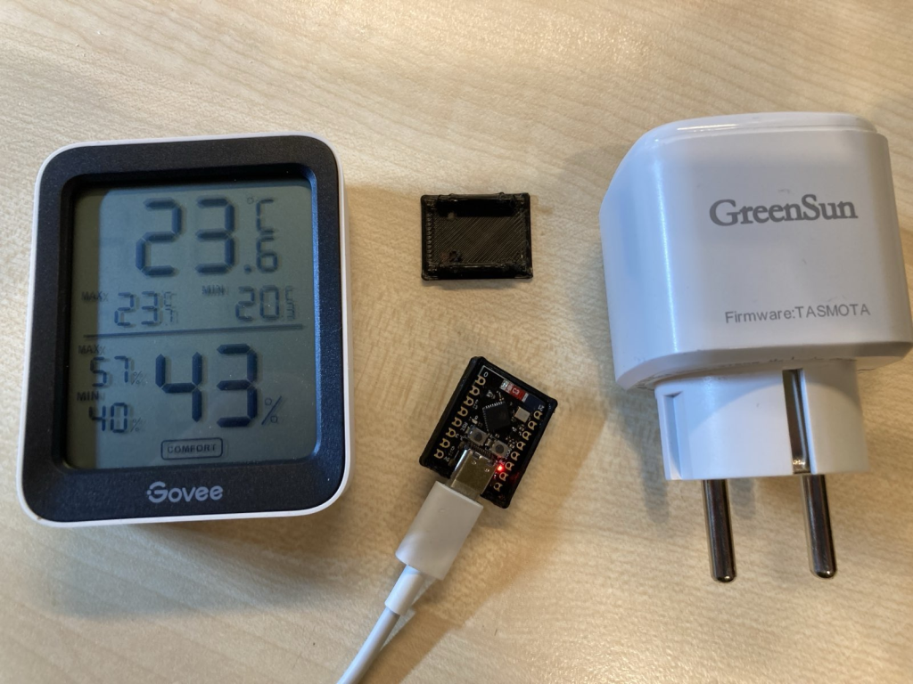
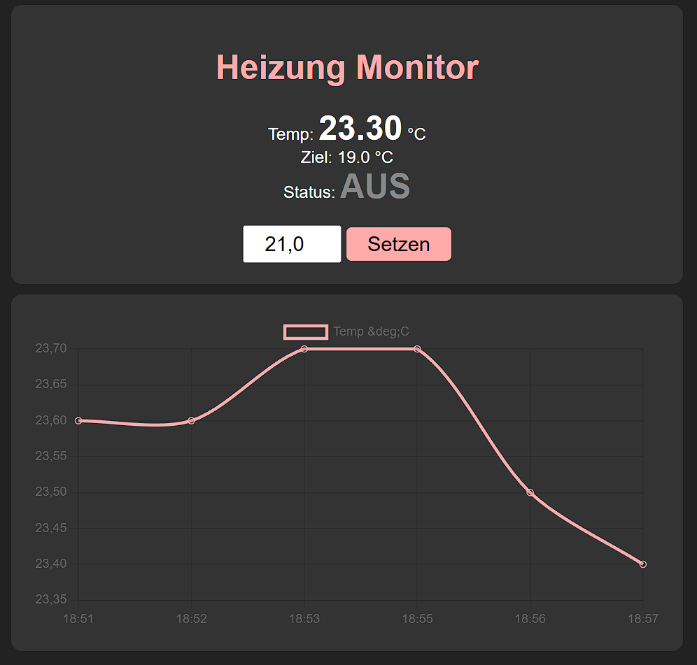

# Heizungssteuerung 

## Hintergrund

Ein guter Freund hat mich nach einer einfachen Heizungssteuerung gefragt. Er hat einen Raum, welchen er mit einem kleinen Heizlüfter zusätzlich beheizen will. Hier würde er gerne eine Temperatur festlegen, bei der der Lüfter angeschaltet wird (und über eine Hysterese wieder ausgeschaltet wird).

Es gibt zwar fertige und auch günstige Lösungen hierfür, mein Ansatz war jedoch eine offene und einfach zu erweiternde Lösung zu erstellen. Also mit Open Source Software und offenen Protokollen, so dass man dies auch einfach in eine Hausautomatisierung einbinden könnte. Und als Standalone-Lösung mit Features wie Temperaturverlauf per Handyansicht.

Hinweis: Das Setup und die Konfiguration ist aufwendiger als proprietäre Lösungen und sollte von technisch versierten Personen vorgenommen werden. 

## Komponenten



Folgende Komponenten habe ich verwendet (Amazon Links, die Produkte sind aber auch anderweitig zu bekommen):
* [WIFI Schaltsteckdose mit Open Source Tasmota Firmware](https://www.amazon.de/Steckdose-Stromz%C3%A4hler-Greensun-Stromverbrauch-Assistant/dp/B0CMLYL8FG)
* [Bluetooth Temperatur/Feuchte Sensor](https://www.amazon.de/Govee-Thermometer-Benachrichtigungs-Datenspeicherung-Gew%C3%A4chshaus/dp/B086YX1MKB)
* [ESP32-C3 Mini zur Steuerung](https://www.amazon.de/DUBEUYEW-Entwicklungsboard-unterst%C3%BCtzt-Bluetooth-kompatibel/dp/B0DMNBWTFD)
* [kleines Gehäuse für den 3D Drucker](https://www.thingiverse.com/thing:6653126)

Der Govee Sensor ist aus Erfahrung gut geeignet, da die Anbindung an den ESP32 prima klappt und das Gerät sehr robust gebaut ist (habe dies auch im Außeneinsatz, obwohl eigentlich ein Indoor Sensor). Zusätzlich halten die Batterien recht lange.

Die Schaltsteckdose ist zwar etwas teurer als andere WIFI Steckdosen, dafür ist die Firmware komplett Open Source und kann problemlos aktualisiert werden. Es werden keine Daten in irgendeine Herstellercloud versendet und man benötigt auch keine extra App um die Steckdose zu konfigurieren.

Der ESP32-C3 ist eine sehr kostengünstige Lösung, um WIFI und Bluetooth (zumindest BLE) einfach zu verbinden. Im direkten Versand aus Asien bekommt man das kleine Modul schon ab 1,50€. MicroPython eignet sich hervorragend für solche kleine Lösungen; ansonsten ist die Softwareentwicklung mit z.B. C und Visual Studio Code mit PlatformIO und dem Arduino Framework zu empfehlen. Inzwischen klappt hierbei auch gut die Verwendung einer KI zur Unterstützung der Implementierung. Ich habe gute Erfahrungen mit Claude Code, Google Gemini, OpenAI Codex sowie dem Open Source Agenten 'Opencode' gemacht. 

Das 3D Gehäuse ist nicht unbedingt notwendig, sieht aber besser aus. Ich habe noch zusätzlich ein kleines Loch gebohrt, um die rote Power-LED sichtbar zu machen.

## Setup

Der ESP32-C3 liest per Bluetooth die Temperatur vom Govee Sensor. Das MicroPython Programm prüft regelmäßig die Temperatur und sendet per WIFI REST (HTTP) Call entsprechende Steuerbefehle an die Steckdose. 

Die aktuelle Implementierung unterstützt nun zwei Betriebsmodi für WIFI, konfigurierbar in `settings.json` über den Parameter `"wifi_mode"`:
*   **Station (STA) Mode:** Der ESP32 verbindet sich mit einem bestehenden WIFI-Netzwerk. Dies ist der Standardmodus und eignet sich, wenn ein Router mit Internetzugang vorhanden ist.
*   **Access Point (AP) Mode:** Der ESP32 öffnet einen eigenen Access Point (WIFI-Netzwerk), zu dem sich andere Geräte verbinden können (z.B. die Tasmota Steckdose oder ein Smartphone für die Web-Oberfläche). SSID und Passwort werden ebenfalls in `settings.json` festgelegt.

**Wichtig für AP-Mode:** Wenn der ESP32 als Access Point fungiert, muss die Tasmota Steckdose mit einer **festen IP-Adresse** (z.B. `192.168.4.100`) konfiguriert werden. Diese Adresse muss dann auch im `settings.json` des ESP32 unter `"tasmota_ip"` hinterlegt werden. Dies verhindert IP-Konflikte, da der DHCP-Server des ESP32 diese Adresse dann nicht an andere Clients vergibt.

### MQTT-Integration (STA-Mode)

Im STA-Mode kann der ESP32 optional mit einem MQTT-Broker kommunizieren, was die Einbindung in Hausautomatisierungssysteme wie Home Assistant, openHAB oder ioBroker erleichtert. Die Konfiguration erfolgt in `settings.json`:

```json
"mqtt_broker": "192.168.1.10",
"mqtt_port": 1883,
"mqtt_user": "benutzer",
"mqtt_pass": "passwort",
"mqtt_topic": "heizung/esp32",
"mqtt_publish_interval": 5
```

Der ESP32 veröffentlicht alle `mqtt_publish_interval` Minuten den aktuellen Status als JSON auf dem Topic `{mqtt_topic}/status`:

```json
{"target_temp": 19.0, "current_temp": 18.3, "current_hum": 52.1, "heating": true}
```

Die Zieltemperatur kann per MQTT gesetzt werden, indem ein Float-Wert (z.B. `21.5`) an das Topic `{mqtt_topic}/set/target_temp` gesendet wird. Der Wert wird sofort übernommen und in `settings.json` gespeichert. MQTT ist nur im STA-Mode aktiv und wird automatisch deaktiviert, wenn `mqtt_broker` leer bleibt.

Für MicroPython kann man einen Webinstaller verwenden (funktioniert nicht mit allen Browsern): https://bipes.net.br/flash/2025/, die passende Firmware findet man hier: https://micropython.org/download/ESP32_GENERIC_C3/

## Software



Die MicroPython Software für den ESP32 wurde fast komplett mit Hilfe von Google Gemini 3 und Claude Code erstellt. Enthalten ist eine kleine Webpage, welche per u.a. Smartphone verwendet werden kann. Das frühere Chart.js zur Diagrammdarstellung wurde durch eine ressourcenschonende, selbst implementierte SVG-Grafik ersetzt. Zusätzlich unterstützt die Software im STA-Mode eine optionale MQTT-Anbindung zur Integration in Hausautomatisierungssysteme.

## Disclaimer

Anwendung auf eigene Gefahr. 

## Lizenz

MIT